# Perfume_store_bot
Удобный сервис для маленького стартапа для привлечения клиентов.
# Описание
Сервис для использования маленьким стартапом из Тамбова.

   
# Mermaid схемы

```mermaid
erDiagram
    users {
        int id PK "Первичный ключ"
        bigint telegram_id UK "Уникальный Telegram ID"
        varchar first_name "Имя пользователя"
        date birth_date "Дата рождения"
        boolean is_admin "Админ ли? (по секретному коду)"
        int invited_by FK "Кто пригласил (реферальная система)"
        timestamp created_at "Дата регистрации"
    }
    
    perfumes {
        int id PK "Первичный ключ"
        varchar name "Название парфюма"
        text description "Описание"
        decimal price_30ml "Цена за 30 мл"
        decimal price_50ml "Цена за 50 мл"
        varchar category "Категория: женские, мужские, унисекс"
        varchar country "Страна-производитель"
        int release_year "Год выпуска"
        text notes_top "Верхние ноты"
        text notes_middle "Средние ноты"
        text notes_base "Базовые ноты"
        int stock_30ml "Остаток 30 мл"
        int stock_50ml "Остаток 50 мл"
        int created_by FK "Кто добавил (админ)"
        timestamp created_at "Дата добавления"
    }
    
    perfume_images {
        int id PK "Первичный ключ"
        int perfume_id FK "ID парфюма"
        varchar telegram_file_id "Telegram file_id для быстрого показа"
        varchar telegram_file_unique_id "Уникальный ID файла в Telegram"
        boolean is_main "Главное фото"
        timestamp created_at "Дата загрузки"
    }
    
    orders {
        int id PK "Первичный ключ"
        varchar order_number UK "Номер заказа (генерируется)"
        int user_id FK "ID пользователя"
        varchar status "Статус: new, processing, shipping, delivered, cancelled"
        decimal total_amount "Общая сумма"
        varchar promo_code "Использованный промокод"
        timestamp created_at "Дата создания"
    }
    
    order_items {
        int id PK "Первичный ключ"
        int order_id FK "ID заказа"
        int perfume_id FK "ID парфюма"
        varchar volume_ml "Объем: 30ml, 50ml"
        int quantity "Количество"
        decimal price_at_time "Цена на момент заказа"
        timestamp created_at "Дата создания"
    }
    
    cart_items {
        int id PK "Первичный ключ"
        int user_id FK "ID пользователя"
        int perfume_id FK "ID парфюма"
        varchar volume_ml "Объем: 30ml, 50ml"
        int quantity "Количество"
        timestamp added_at "Дата добавления в корзину"
    }
    
    favorites {
        int id PK "Первичный ключ"
        int user_id FK "ID пользователя"
        int perfume_id FK "ID парфюма"
        timestamp added_at "Дата добавления в избранное"
    }
    
    promo_codes {
        int id PK "Первичный ключ"
        varchar code UK "Уникальный промокод"
        int owner_id FK "Владелец (кто пригласил)"
        int used_by_id FK "Кто использовал"
        decimal discount_percent "Процент скидки"
        boolean is_used "Использован ли"
        timestamp created_at "Дата создания"
        timestamp used_at "Дата использования"
    }

    %% Связи
    users ||--o{ orders : "размещает"
    users ||--o{ cart_items : "имеет в корзине"
    users ||--o{ favorites : "добавляет в избранное"
    users ||--o{ promo_codes : "генерирует для друга"
    users ||--o{ perfumes : "создает"
    users ||--o{ users : "приглашает"

    perfumes ||--o{ perfume_images : "имеет фото"
    perfumes ||--o{ order_items : "входит в заказ"
    perfumes ||--o{ cart_items : "в корзине"
    perfumes ||--o{ favorites : "в избранном"

    orders ||--|{ order_items : "содержит"
    orders }o--|| promo_codes : "использует"
```

```mermaid
flowchart TD
    Start([Начало /start]) --> CheckDB{Пользователь в БД?}
    
    CheckDB -->|Нет| Register[Регистрация]
    Register --> AskName[Как вас зовут?]
    AskName --> CheckAdminName{Имя = секретное?}
    
    CheckAdminName -->|Да, админ| AskAdminVerification[Запросить доп. подтверждение]
    AskAdminVerification --> AdminVerified{Подтверждено?}
    AdminVerified -->|Да| CreateAdmin[Создать пользователя с is_admin=TRUE]
    AdminVerified -->|Нет| CreateClient[Создать пользователя с is_admin=FALSE]
    
    CheckAdminName -->|Нет, клиент| AskBirthDate[Дата рождения ДД.ММ.ГГГГ]
    AskBirthDate --> CreateClient
    
    CreateAdmin --> ShowAdminMenu[Показать админ-меню<br>Добавить аромат ✏️<br>Редактировать каталог 📋<br>Заказы 📦<br>Пользователи 👥<br>Рассылка 📢]
    CreateClient --> ShowClientMenu[Показать клиентское меню<br>Каталог 🛍️<br>Найти 🔍<br>Понравилось ❤️<br>Заказы 📦<br>Корзина 🛒<br>Консультация 💬<br>Пригласить друга 👫]
    
    CheckDB -->|Да| GetUser[Получить данные пользователя из БД]
    GetUser --> CheckAdminStatus{is_admin = TRUE?}
    CheckAdminStatus -->|Да| ShowAdminMenu
    CheckAdminStatus -->|Нет| ShowClientMenu
    
    ShowAdminMenu --> AdminChoice{Выбор в админ-меню}
    ShowClientMenu --> ClientChoice{Выбор в клиент-меню}
    
    AdminChoice --> A1[Добавить аромат]
    AdminChoice --> A2[Редактировать каталог]
    AdminChoice --> A3[Заказы]
    AdminChoice --> A4[Пользователи]
    AdminChoice --> A5[Рассылка]
    AdminChoice --> BackToStart[Вернуться в /start]
    
    ClientChoice --> C1[Каталог]
    ClientChoice --> C2[Найти]
    ClientChoice --> C3[Понравилось]
    ClientChoice --> C4[Заказы]
    ClientChoice --> C5[Корзина]
    ClientChoice --> C6[Консультация]
    ClientChoice --> C7[Пригласить друга]
    ClientChoice --> BackToStart
    
    BackToStart --> Start
```

```mermaid
flowchart TD
    AdminMenu[Админ-меню] --> AdminActions{Выберите действие}
    
    AdminActions --> AddPerfume[➕ Добавить аромат]
    AddPerfume --> AP1[📸 Прикрепите фото]
    AP1 --> AP2[✍️ Название аромата]
    AP2 --> AP3[📝 Описание]
    AP3 --> AP4[💰 Цены: 30мл=XXX ₽, 50мл=YYY ₽]
    AP4 --> AP5[👫 Тип: жен/муж/унисекс]
    AP5 --> AP6[🌸 Ноты: верхние/средние/базовые]
    AP6 --> AP7[🌍 Страна-производитель]
    AP7 --> AP8[📅 Год выпуска]
    AP8 --> AP9[📦 Количество на складе]
    AP9 --> AP10[✅ Сохранить в БД]
    
    AdminActions --> EditCatalog[✏️ Редактировать каталог]
    EditCatalog --> EC1[📋 Список всех ароматов]
    EC1 --> EC2[Выберите аромат]
    EC2 --> EditOptions{Действие}
    EditOptions --> Delete[🗑️ Удалить]
    EditOptions --> Edit[✏️ Редактировать]
    Edit --> EC3[Изменить поля<br>как при добавлении]
    
    AdminActions --> ManageOrders[📦 Заказы]
    ManageOrders --> MO1{Тип заказов}
    MO1 --> New[🆕 Новые]
    MO1 --> Current[⏳ Текущие]
    MO1 --> Old[📜 Старые]
    
    New --> NO1[Список новых заказов]
    NO1 --> NO2[Выберите заказ]
    NO2 --> ChangeStatus{Изменить статус}
    ChangeStatus --> Processing[🔄 В обработке]
    ChangeStatus --> Shipping[🚚 В доставке]
    ChangeStatus --> Delivered[✅ Доставлен]
    
    AdminActions --> ViewUsers[👥 Пользователи]
    ViewUsers --> VU1[📋 Список пользователей]
    VU1 --> VU2[Показано: Имя + Дата регистрации]
    
    AdminActions --> SendMailing[📢 Рассылка]
    SendMailing --> SM1{Тип рассылки}
    SM1 --> Auto[🎂 Авто на ДР]
    SM1 --> Manual[✍️ Ручная рассылка]
    Manual --> SM2[Введите текст]
    SM2 --> SM3[📤 Отправить всем]
```



```mermaid
flowchart TD
    КлиентскоеМеню[Клиентское меню] --> ВыборКлиент{Выберите раздел}
    
    ВыборКлиент --> Каталог[🛍️ Каталог]
    Каталог --> К1[📋 Показать каталог<br>10 товаров на странице]
    К1 --> К1Навигация{Навигация}
    К1Навигация --> К1Товар[Выберите товар]
    К1Товар --> К1Карточка[Карточка товара<br>Фото, описание, цена 30мл/50мл]
    К1Карточка --> К1Действия{Действия}
    К1Действия --> К1ВКорзину[🛒 В корзину]
    К1Действия --> К1Понравилось[❤️ Понравилось]
    К1Действия --> К1Консультация[💬 За консультацией]
    К1Действия --> К1Назад[◀️ Назад в каталог]
    К1Действия --> К1ВМеню[🏠 В главное меню]
    
    К1Навигация --> К1Следующая[▶️ Следующая страница]
    К1Навигация --> К1Предыдущая[◀️ Предыдущая страница]
    К1Навигация --> К1ВМеню2[🏠 В главное меню]
    
    ВыборКлиент --> Поиск[🔍 Найти]
    Поиск --> П1[Введите название парфюма]
    П1 --> П2[🔍 Поиск...]
    П2 --> П3{Результаты}
    П3 -->|Найдено| П4[📋 Показать результаты<br>макс. 10 на страницу]
    П3 -->|Не найдено| П5[😔 Ничего не нашлось]
    
    П4 --> П4Навигация{Навигация}
    П4Навигация --> П4Товар[Выберите товар]
    П4Товар --> К1Карточка
    П4Навигация --> П4Назад[◀️ Назад к поиску]
    П4Навигация --> П4ВМеню[🏠 В главное меню]
    
    П5 --> П5Действия{Действия}
    П5Действия --> П5Повторить[🔄 Повторить поиск]
    П5Действия --> П5ВМеню[🏠 В главное меню]
    
    ВыборКлиент --> Понравилось[❤️ Понравилось]
    Понравилось --> Лю1[📋 Показать избранное<br>10 товаров на странице]
    Лю1 --> Лю1Навигация{Навигация}
    Лю1Навигация --> Лю1Товар[Выберите товар]
    Лю1Товар --> К1Карточка
    Лю1Навигация --> Лю1Следующая[▶️ Следующая]
    Лю1Навигация --> Лю1Предыдущая[◀️ Предыдущая]
    Лю1Навигация --> Лю1ВМеню[🏠 В главное меню]
    
    ВыборКлиент --> ЗаказыКлиент[📦 Заказы]
    ЗаказыКлиент --> Зк1[📋 Список заказов:<br>1 #001 21.01.2024<br>2 #002 20.01.2024<br>3 #003 19.01.2024]
    Зк1 --> Зк1Навигация{Выберите заказ}
    Зк1Навигация --> Зк1Заказ[Выберите заказ №]
    Зк1Заказ --> Зк1Детали[📄 Детали заказа:<br>Номер: #001<br>Дата: 21.01.2024<br>Статус: В обработке]
    Зк1Детали --> Зк1Действия{Действия}
    Зк1Действия --> Зк1Связаться[📞 Связаться с нами]
    Зк1Действия --> Зк1Отменить[❌ Отменить заказ]
    Зк1Действия --> Зк1Назад[◀️ Назад к списку]
    Зк1Действия --> Зк1ВМеню[🏠 В главное меню]
    
    Зк1Связаться --> Зк1Админ[Отправляет: @admin_username<br>+ кнопка Вернуться в главное меню]
    Зк1Отменить --> Зк1Подтвердить[Введите номер заказа<br>для подтверждения отмены]
    
    Зк1Навигация --> Зк1Следующая[▶️ Следующая]
    Зк1Навигация --> Зк1Предыдущая[◀️ Предыдущая]
    Зк1Навигация --> Зк1ВМеню2[🏠 В главное меню]
    
    ВыборКлиент --> Корзина[🛒 Корзина]
    Корзина --> Кор1[📋 Содержимое корзины<br>10 товаров на странице]
    Кор1 --> Кор1Навигация{Действия}
    Кор1Навигация --> Кор1Товар[Выберите товар]
    Кор1Товар --> Кор1Карточка[Карточка товара в корзине]
    Кор1Карточка --> Кор1Действия{Действия}
    Кор1Действия --> Кор1Удалить[🗑️ Удалить из корзины]
    Кор1Действия --> Кор1Консультация[💬 За консультацией]
    Кор1Действия --> Кор1Назад[◀️ Назад в корзину]
    
    Кор1Навигация --> Кор1Очистить[🗑️ Очистить корзину]
    Кор1Очистить --> Кор1Подтвердить{Подтвердить очистку?}
    Кор1Подтвердить -->|Да| Кор1Очищено[✅ Корзина очищена]
    Кор1Подтвердить -->|Нет| Кор1
    
    Кор1Навигация --> Кор1Заказать[✅ Заказать]
    Кор1Заказать --> Кор1Промокод[Введите промокод<br>или пропустить]
    Кор1Промокод --> Кор1Расчет[💰 Расчет суммы<br>с учетом скидки]
    Кор1Расчет --> Кор1Итог[📋 Итог заказа:<br>Товары: X ₽<br>Скидка: Y ₽<br>Итого: Z ₽]
    Кор1Итог --> Кор1ПодтвердитьЗаказ{Подтвердить заказ?}
    Кор1ПодтвердитьЗаказ -->|Да| Кор1ЗаказСоздан[✅ Заказ создан!<br>Номер: #005]
    Кор1ПодтвердитьЗаказ -->|Нет| Кор1
    
    Кор1Навигация --> Кор1Следующая[▶️ Следующая]
    Кор1Навигация --> Кор1Предыдущая[◀️ Предыдущая]
    Кор1Навигация --> Кор1ВМеню[🏠 В главное меню]
    
    ВыборКлиент --> Консультация[💬 Консультация]
    Консультация --> Конс1[Свяжитесь с нами:<br>@perfume_admin]
    Конс1 --> Конс1Назад[◀️ Назад]
    Конс1 --> Конс1ВМеню[🏠 В главное меню]
    
    ВыборКлиент --> Пригласить[👫 Пригласить друга]
    Пригласить --> Приг1[🎁 Генерация промокода...]
    Приг1 --> Приг2[Ваш промокод:<br>PERFUME-ABC123]
    Приг2 --> Приг2Назад[◀️ Назад]
    Приг2 --> Приг2ВМеню[🏠 В главное меню]
```
